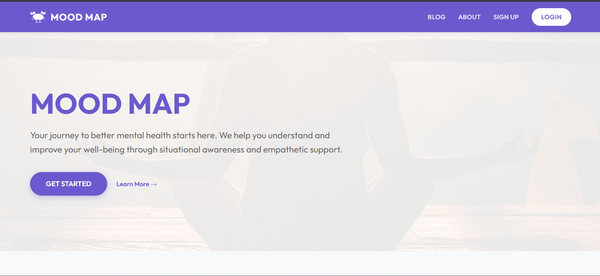
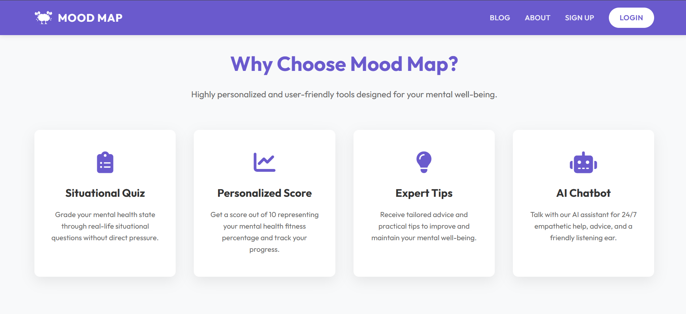
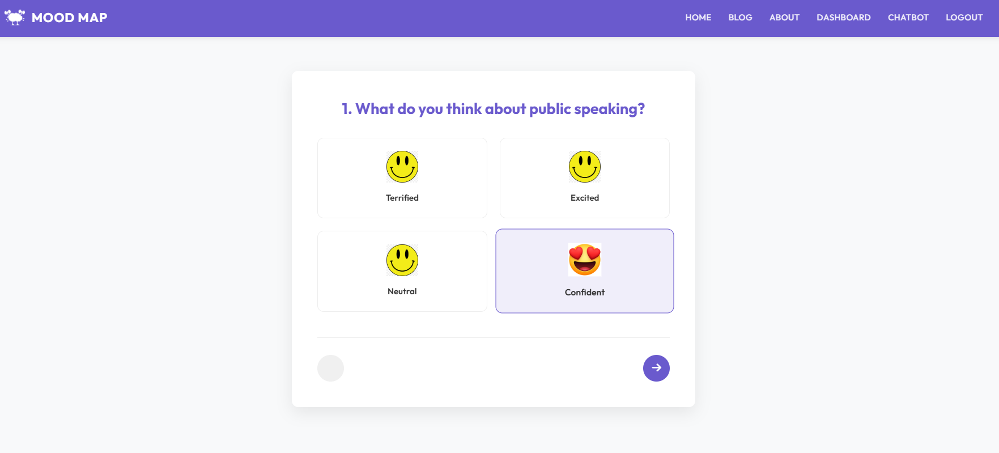
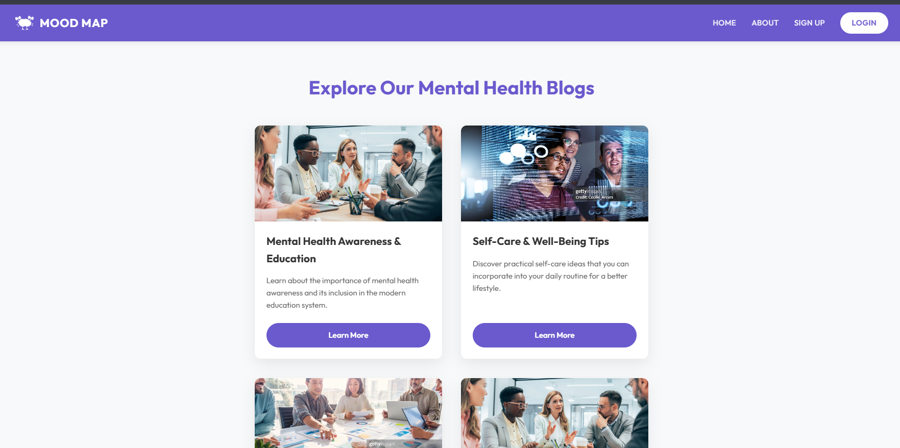
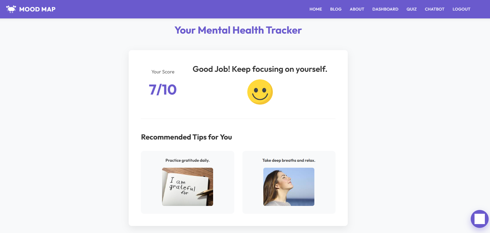
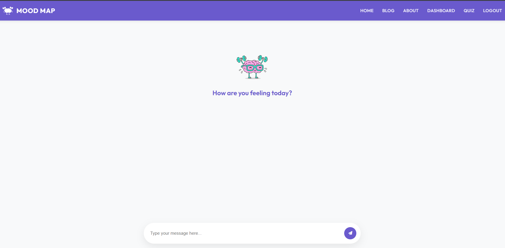
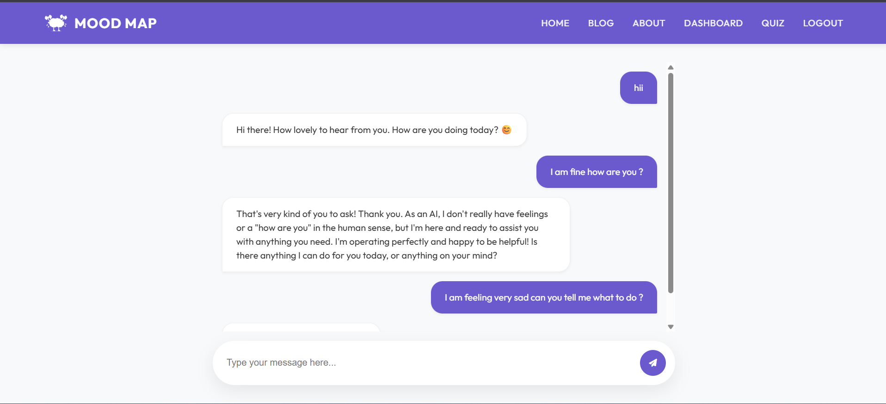

Here’s a clean, professional, GitHub-ready README.md for your Mental Health Web App (Mood Map Project) with proper structure, placeholders for screenshots, host link, tech stack icons, and workflow.
You can directly copy-paste this into your README.md file 👇
Markdown
# 🧠 Mental Health Web App (Mood Map)

An intelligent, user-friendly web application designed to analyze a user's mental wellness state through situational quizzes and behavioral responses, and provide personalized insights, tips, and an AI chatbot for support.

> ⚠️ Disclaimer: This app does NOT provide medical diagnosis or treatment. It is only for awareness and self-reflection. For serious concerns, always consult a licensed mental health professional.

---

## 🌐 Live Demo
🔗 Hosted Link: **[Add Your Deployment Link Here]**

---

## ✨ Features

- 🔐 User Authentication (Login / Signup)
- 🎯 Interactive Mental Health Quiz (Situational Questions)
- 📊 Mood Score System (Out of 10 → Mental Fitness %)
- 💡 Personalized Suggestions & Improvement Tips
- 🤖 AI Chatbot (Powered by Gemini API)
- 📈 Behavioral-based analysis instead of direct questioning
- 🧠 Simple, clean, and user-friendly UI

---

## ⚙️ How It Works

1. Create an account or login if you already have one  
2. Navigate to **"Start Here"** section  
3. Attempt a situational quiz (real-life behavioral questions)  
4. Receive your **Mental Health Score (0–10 scale)**  
5. Get personalized improvement tips  
6. Chat with AI assistant for emotional support & guidance  

---

## 🧱 Tech Stack

### 🎨 Frontend
- HTML5  
- CSS3  
- JavaScript  

### ⚙️ Backend
- Python  
- Flask  

### 🗄️ Database
- SQLite  

### 🤖 AI Integration
- Gemini API (for chatbot functionality)

---

## 📸 Screenshots

> Replace these placeholders with your actual screenshots

### 🏠 Home Page



### 🧠 Quiz Interface


### 🧠 Blogs


### 📊 Result Dashboard


### 🤖 AI Chatbot



---

## 🔄 Workflow Architecture
User Login/Register ↓ Start Quiz (Situational Questions) ↓ Behavior Analysis Engine ↓ Mood Score Calculation (0–10) ↓ Personalized Suggestions ↓ AI Chatbot Interaction (Gemini API)

---

## 🛠️ Installation & Setup

### 1️⃣ Clone Repository
```bash
git clone https://github.com/your-username/mood-map.git
cd mood-map
```
2️⃣ Install Dependencies
```bash
pip install -r requirements.txt
```
3️⃣ Add Gemini API Key
Create a .env file and add:
Environment
```bash
GEMINI_API_KEY=your_api_key_here
```
4️⃣ Run Application
Using Flask:
```bash
flask run
```
OR
```bash
python app.py
```
5️⃣ Open in Browser
```bash
http://localhost:5000/
```

### 📌 Future Improvements (TODO)
🧠 Make quiz adaptive (dynamic difficulty based on user responses)
📊 Improve ML-based mental state prediction model
📱 Make fully responsive mobile-first UI
📈 Add progress tracking over time
🔔 Add reminders & wellness notifications
👨‍💻 Project Status
🚧 Currently Under Development
✔ Core features implemented
⚙ Enhancements in progress


### ✨Inspiration
This project is built to promote mental awareness using technology, helping users reflect on their emotional state through indirect behavioral analysis instead of direct questioning.

🤝 Contribution
Pull requests are welcome. For major changes, please open an issue first to discuss what you would like to change.

## 🙌 Developer
Amisha Bhasme
Gauri Bhasme


# Mental_Health_Web_App
The mental health web app is designed to grade the mental health state of a person and suggest them some tips to improve and maintain it and a featured chatbot to interact with. It is highly personalized and user friendly.
It is a way of knowing the User's mood and mental health state and improve it without directly asking them by situational questions and their behaviour throghout....

## How It Works : 

1. create an account or login if you are already a user
2. Go to Start here 
3. Play a quiz by answering some real life situational questions 
4. Get your Score out of 10 . It is not only score it is the  percentage of your mental health fitness
5. Get some tips and advices to improve your mental health
6. Addditionally talk with Our AI chatbot to get more help and advice

NOTE : The app is still under development and we are working on it to make it more user friendly and efficient.
The app only predicts the mental health state of a person and does not provide any medical advice. It is always recommended to consult a mental health professional for any serious mental health concerns.


### HOW TO RUN THE APP :
1. Add your Gemini Api key to interact with the chatbot
2. install the required packages using pip
```bash
pip install -r requirements.txt
```
3. run the app using the following command
```bash
python app.py
```
OR
```bash
flask run
```
4. The app will be running on the local host on port 5000
5. You can access the app by going to http://localhost:5000/


### todo
1. Make the quiz adaptive to know the mental health state of a user based on his/her/they's mental health state in more deep
2. 